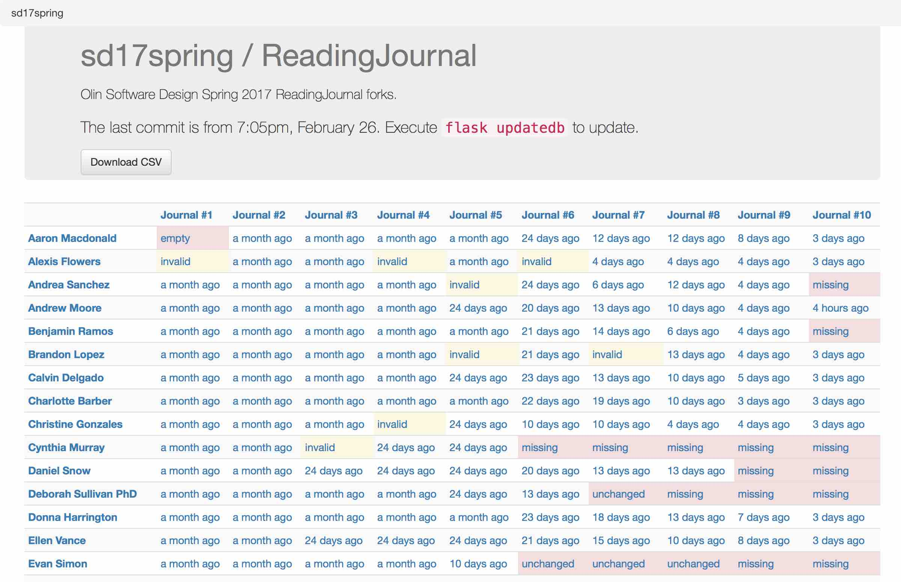
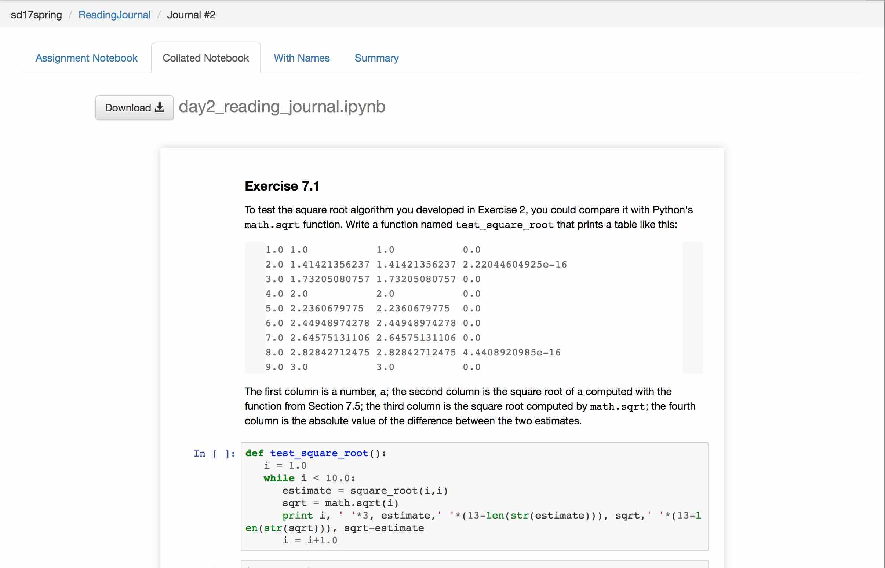
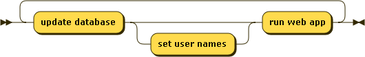

# Assignment Dashboard

Assignment Dashboard is a Flask web application that displays Jupyter files within a GitHub "assignment" repository, and their status within each forked "student" repository.

The app displays whether files are present in the student repository; if so, whether they have been changed, and whether they are valid Jupyter notebook files. Student repositories and files are linked to GitHub.

Clicking on an assignment title displays a collated notebook, with all student answers collected beneath each prompt.

The app also displays additional information about each assignment.

## Status

The application does not use authentication, so it should not be run on the open web or in a shared location. (Technically it does not expose any information that is not openly available from the GitHub web interface and API, but it makes this information easier to find.)

## Setup

These instructions use Docker.
See [here](./docs/install-without-docker.md) for alternate instructions that don't use Docker.

... generated by [Railroad Diagram Generator](http://www.bottlecaps.de/rr/ui)

Do these once:

### 1. Install docker-compose

For example: `pip install docker-compose`; or one of the installers [here](https://docs.docker.com/compose/install/).

### 2. Retrieve a GitHub personal API token

[Create a personal GitHub API token](https://github.com/blog/1509-personal-api-tokens).
Set the `GITHUB_API_TOKEN` environment variable to this value.

### 3. Initialize the database

    docker-compose run web initdb

This creates a database in `data/database.db`.

It will take a while to run, as Docker creates the application image.

If you subsequently need to run it again in order to reset the database, it will use this existing image.

### 4. Add an assignment repository

    $ docker-compose run web add_repo repo_owner/repo_name

Add a repository to the database, and download its information from GitHub.

## Usage

These instructions use Docker.
See [here](./docs/install-without-docker.md) for alternate instructions that don't use Docker.

The admin tasks update the project database from GitHub.
The web application browses the data in this database.

... generated by [Railroad Diagram Generator](http://www.bottlecaps.de/rr/ui)

### Admin Tasks

#### Update the database

    $ docker-compose run web updatedb

Update the application database with new users and commits from GitHub.

#### Set User Names

    $ docker-compose run web set_usernames usernames.csv

Update user names in the database from the rows in `usernames.csv`.

`usernames.csv` should be a CSV file with a column named "name" or "username",
and a column that contains the string "git" (or mixed-case versions of these
strings).

Subsequent execution of `updatedb` will replace usernames in the database
by the user's GitHub name if the GitHub name is not empty.

### Run the Web Application

    $ docker-compose up

Then browse to <http://localhost:5000>.

File bugs and enhancement requests [here](https://github.com/osteele/assignment-dashboard/issues).

## Contributing

See [CONTRIBUTING.md](CONTRIBUTING.md) for contribution guidelines.

## Acknowledgments

The notebook collation code is derived from original work ([paulruvolo/SoftDesSp16Prep](https://github.com/paulruvolo/SoftDesSp16Prep)) by Paul Ruvolo at Olin College, further modified at [osteele/assignment-tools](https://github.com/osteele/assignment-tools).
