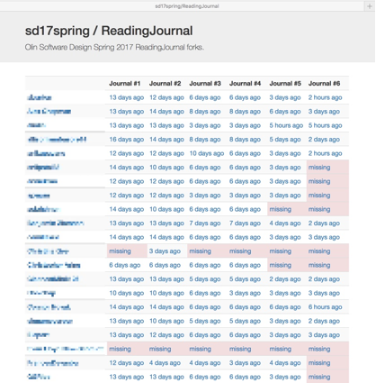

# Assignment Dashboard

A web app that displays the forks of files in a GitHub repository (currently hardwired to `sd17spring/ReadingJournal`),
in tabular format.

## Status

It works for me :-)

Possible enhancements are listed [here](https://github.com/osteele/assignment-dashboard/issues?q=is%3Aopen+is%3Aissue+label%3Aenhancement),
with the [next major milestone](https://github.com/osteele/assignment-dashboard/issues?utf8=✓&q=is%3Aopen%20is%3Aissue%20milestone%3A%22Web%201.0%22%20) being to run it in the cloud.

## Setup

### 1. Install Python

Install Python 3.5 or greater. (Lesser versions of Python 3 will likely work but are untested. Python 2 is right out.)

### 2. Install required Python packages

Install sqlite3.

Then:

    $ pip3 install -r requirements.txt

Depending on how Python is installed, you may need to prefix `pip3 install …` by `sudo`.

### 3. Retrieve a GitHub personal API token

[Create a personal GitHub API token](https://github.com/blog/1509-personal-api-tokens)
and set the `GITHUB_API_TOKEN` environment variable to this value.

### 4. Initialize the database

    $ FLASK_APP=assignment_dashboard flask initdb

## Usage

The code has two components. The updater updates the project database from GitHub.
The web application browses the data in this database.

### Update the database

    $ FLASK_APP=assignment_dashboard python updatedb

This picks up new commits.

### Run the Web Application

    $ FLASK_APP=assignment_dashboard flask run

Then browse to <http://localhost:4000>.

File bugs and enhancement requests [here](https://github.com/osteele/assignment-dashboard/issues).

## Contributing

### What to Work On

The [GitHub issues](https://github.com/osteele/assignment-dashboard/issues) lists bugs and enhancement requests.

### Style

With exceptions listed in `setup.cfg`, code should conform to [PEP8](https://www.python.org/dev/peps/pep-0008/), [PEP257](https://www.python.org/dev/peps/pep-0257/), and the [Google Python Style Guide](http://google.github.io/styleguide/pyguide.html).

You can verify code against these style guides via:

    $ pip3 install -r requirements-dev.txt  # once
    $ flake8 scripts                        # before each commit

or by setting up a [git pre-commit hook](https://git-scm.com/book/en/v2/Customizing-Git-Git-Hooks) to run the latter command.
