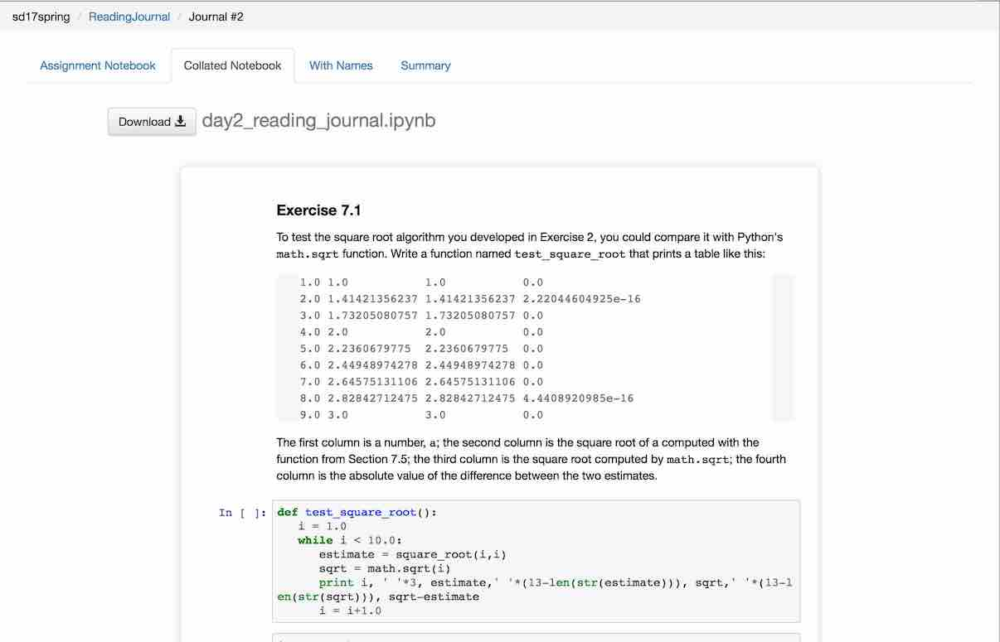
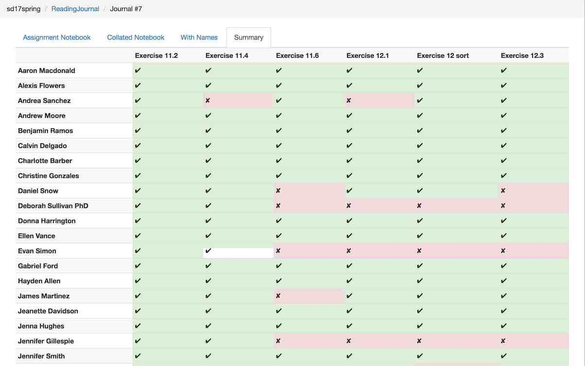

# Assignment Dashboard

A web app that displays the forks of files in a GitHub repository (currently hardwired to `sd17spring/ReadingJournal`),
in tabular format.

## Setup (using Docker)

... generated by [Railroad Diagram Generator](http://www.bottlecaps.de/rr/ui)

Do these once:

### 1. Install docker-compose

For example: `pip install docker-compose`; or one of the installers [here](https://docs.docker.com/compose/install/).

### 2. Retrieve a GitHub personal API token

[Create a personal GitHub API token](https://github.com/blog/1509-personal-api-tokens).
Set the `GITHUB_API_TOKEN` environment variable to this value.

### 3. Initialize the database

    docker-compose run flask initdb

## Usage (using Docker)

The admin tasks update the project database from GitHub.
The web application browses the data in this database.

... generated by [Railroad Diagram Generator](http://www.bottlecaps.de/rr/ui)

### Admin Tasks

#### Update the database

    $ docker-compose run flask updatedb

This picks up new commits.

This will take a while to run the first time.
The next time it will skip commits that have already been ingested*, and will run faster.
It also saves its work one repository at a time (and after each downloaded file),
so if it is interrupted in the middle, it will pick up close to where it left off.

#### Set User Names

    $ docker-compose run flask set_usernames usernames.csv

Update user names in the database from the rows in `usernames.csv`.

`usernames.csv` should be a CSV file with a column named "name" or "username",
and a column that contains the string "git" (or mixed-case versions of these
strings).

Subsequent execution of `updatedb` will replace usernames in the database
by the user's GitHub name if the GitHub name is not empty.

### Run the Web Application

    $ docker-compose up

Then browse to <http://localhost:5000>.

## Setup (w/out Docker)

### 1. Install Python

Install Python 3.5 or greater. (Lesser versions of Python 3 will likely work but are untested. Python 2 is right out.)

### 2. Install required packages

Install [sqlite3](https://www.sqlite.org).

Then:

    $ pip3 install -r requirements.txt
    $ pip3 install --process-dependency-links -e .

Depending on how Python is installed, you may need to prefix `pip3 install …` by `sudo`.

### 3. Retrieve a GitHub personal API token

[Create a personal GitHub API token](https://github.com/blog/1509-personal-api-tokens)
and set the `GITHUB_API_TOKEN` environment variable to this value.

### 4. Initialize the database

    $ env FLASK_APP=assignment_dashboard flask initdb

## Usage (w/out Docker)

The admin tasks update the project database from GitHub.
The web application browses the data in this database.

### Admin Tasks

#### Update the database

    $ env FLASK_APP=assignment_dashboard flask updatedb

This picks up new commits.

This will take a while to run the first time.
The next time it will skip commits that have already been ingested*, and will run faster.
It also saves its work one repository at a time (and after each downloaded file),
so if it is interrupted in the middle, it will pick up close to where it left off.

#### Set User Names

      $ env FLASK_APP=assignment_dashboard flask set_usernames usernames.csv

Update user names in the database from the rows in `usernames.csv`.

`usernames.csv` should be a CSV file with a column named "name" or "username",
and a column that contains the string "git" (or mixed-case versions of these
strings).

A subsequent call to `flask updatedb` will replace usernames in the database
by the user's GitHub name if the GitHub name is not empty.

### Run the Web Application

    $ env FLASK_APP=assignment_dashboard flask run

Then browse to <http://localhost:5000>.

File bugs and enhancement requests [here](https://github.com/osteele/assignment-dashboard/issues).

## Contributions

The notebook collation code is derived from original work ([paulruvolo/SoftDesSp16Prep](https://github.com/paulruvolo/SoftDesSp16Prep)) by Paul Ruvolo at Olin College, further modified at [osteele/assignment-tools](https://github.com/osteele/assignment-tools).

See [CONTRIBUTING.md](CONTRIBUTING.md) for contribution guidelines.
